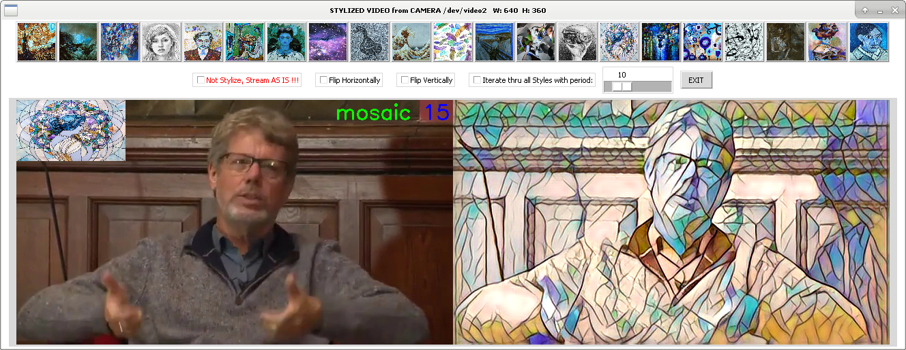
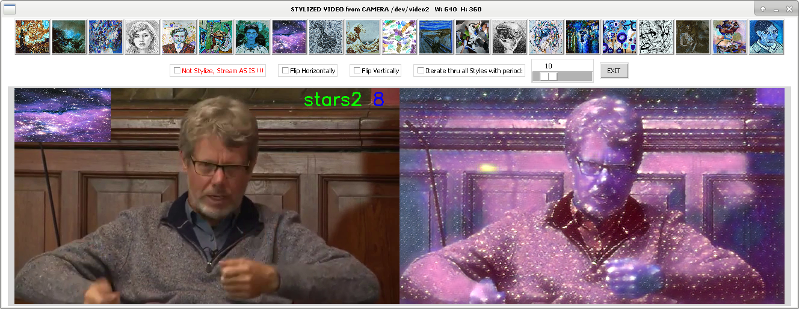
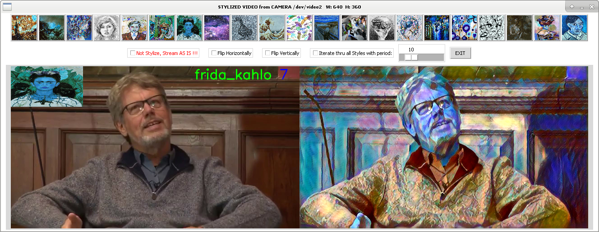
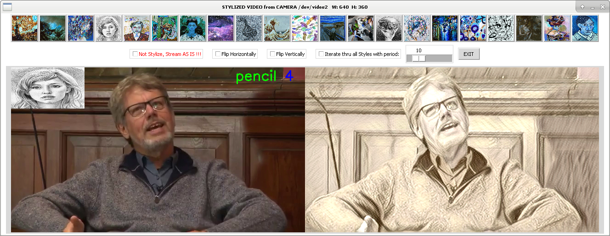
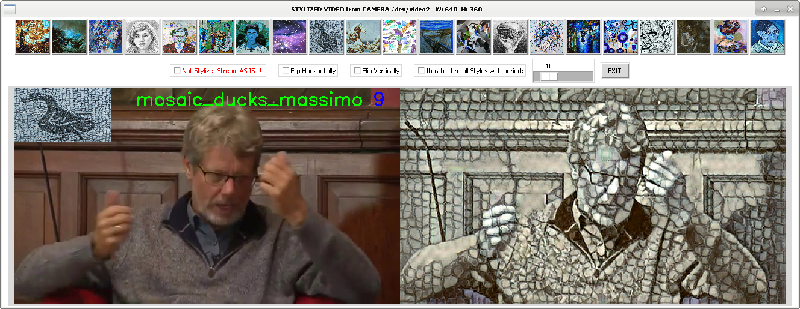
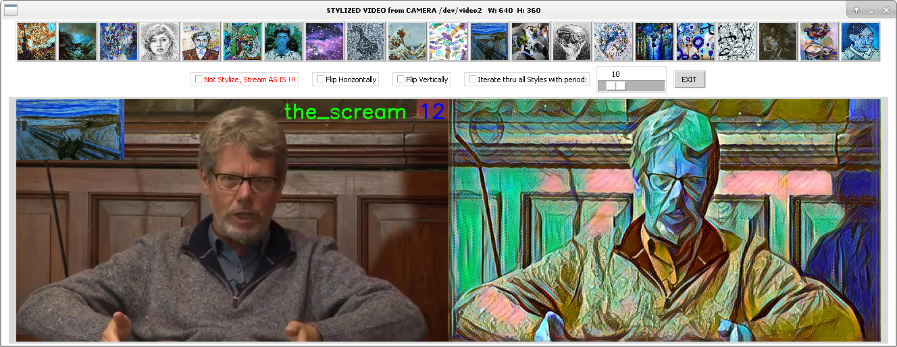
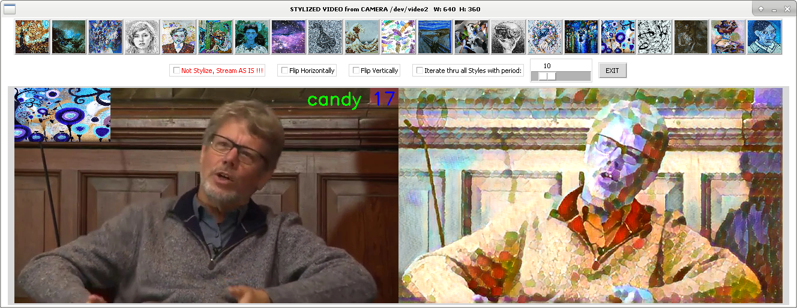
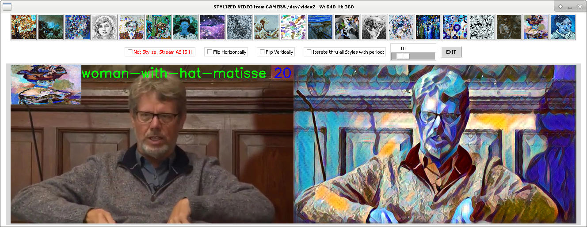

# gvcamera-style
Video neural style transfer filter with virtual camera output  &amp; GUI control panel

gvcamera-style.py application allows you to stylize web-camera video stream according to one of 21 styles and to output stylized video stream to virtual camera device (and optionally, to mp4 file). Virtual camera can be used in Scype or other applications under Linux. So it provides some privacy and a lot of fun)) 

Stylization based on neural network and pretrained model from [MXNet-Gluon-Style-Transfer](https://github.com/StacyYang/MXNet-Gluon-Style-Transfer).
Inference performed via MXNet Gluon framework on CPU and CUDA GPU.

Below some screenshots of app window during 'Guido van Rossum at Oxford Union' Youtube stream stylization:










So how to use this app:

0. Virtual camera should be created before gvcamera-style run:
	```bash
	sudo modprobe v4l2loopback
	```

1. Check virtual camera device number via: 
	```bash
	v4l2-ctl --list-devices
	```

2. Then run gvcamera-style GUI application (with parameters below it takes video from /dev/camera0 and outputs stylized video to virtual camera /dev/camera2 with CUDA GPU acceleration and writing video to mp4 file):
	```bash
	python gvcamera-style.py -d 0 -vd 2 --record --cuda
	```
You can select one of 21 target styles via top row GUI buttons or select auto changing thru all styles with period set by slider.
One 640x480 frame inference with Nvidia 1050 GPU acceleration takes less then a second. So calcule GPU power required for your target fps accordingly.

3. For CLI options help:
	```bash
	python gvcamera-style.py --help
	```

4. Before connectig from Scype or whatever, check virtual camera /dev/vedeo2 video output via this simple application:
	```bash
	python web-cam.py -d 2
	```
This project was created  and tested solely under Linux. Some efforts required to port it to Windows, at least regarding proper v4l2loopback substitution.
